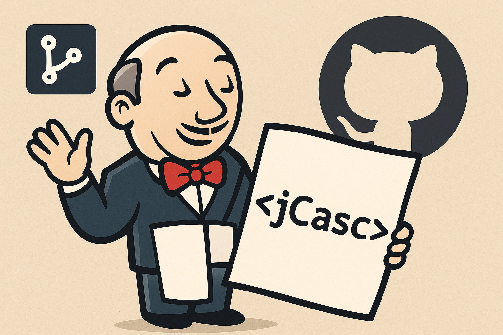

# Jenkins with Configuration as Code (JCasC) Docker Setup

This project provides a ready-to-use Jenkins Docker image configured using Jenkins Configuration as Code (JCasC). It includes pre-installed plugins, initial admin user setup, and custom Groovy scripts.

<div align="center">
  
</div>

## Table of Contents

- [Jenkins with Configuration as Code (JCasC) Docker Setup](#jenkins-with-configuration-as-code-jcasc-docker-setup)
  - [Table of Contents](#table-of-contents)
  - [Features](#features)
  - [Prerequisites](#prerequisites)
  - [File Structure](#file-structure)
  - [Dockerfile Line-by-Line Explanation](#dockerfile-line-by-line-explanation)
  - [Quick Start](#quick-start)
  - [Customization](#customization)
  - [Useful Docker Commands](#useful-docker-commands)
  - [Security Notice](#security-notice)
  - [References](#references)

## Features

- Jenkins preconfigured with JCasC (`casc.yaml`)
- Automatic plugin installation (`plugins.txt`)
- Initial admin user and security setup (`init.groovy`)
- Disables setup wizard and CSRF protection for easier automation

## Prerequisites

- [Docker](https://docs.docker.com/get-docker/) installed on your system
- (Optional) [Docker Compose](https://docs.docker.com/compose/)

## File Structure

```
jcasc/
├── casc.yaml         # JCasC configuration file
├── Dockerfile        # Docker build instructions
├── init.groovy       # Groovy script for initial Jenkins setup
└── plugins.txt       # List of Jenkins plugins to install
```

## Dockerfile Line-by-Line Explanation

Below is an explanation of what each line in the provided `Dockerfile` does:

**Uses the official Jenkins Docker image as the base.**

```dockerfile
FROM jenkins/jenkins:latest
```
**Sets Java options to disable the Jenkins setup wizard and CSRF protection for easier automation.**

```dockerfile
ENV JAVA_OPTS="-Djenkins.install.runSetupWizard=false -Dhudson.security.csrf.GlobalCrumbIssuerConfiguration.DISABLE_CSRF_PROTECTION=true"
```
**Defines the Jenkins home directory inside the container.**

```dockerfile
ENV JENKINS_HOME=/var/jenkins_home
```
**Tells Jenkins Configuration as Code (JCasC) plugin where to find the configuration file.**

```dockerfile
ENV CASC_JENKINS_CONFIG /usr/share/jenkins/ref/casc.yaml
```
**Copies your JCasC YAML configuration file into the image at the specified location.**

```dockerfile
COPY casc.yaml /usr/share/jenkins/ref/casc.yaml
```
**Copies a Groovy script for initial Jenkins setup (e.g., user creation) into the image.**

```dockerfile
COPY init.groovy /usr/share/jenkins/ref/init.groovy.d/init.groovy
```
**Copies the list of plugins to install into the image.**

```dockerfile
COPY plugins.txt /usr/share/jenkins/ref/plugins.txt
```
**Installs all plugins listed in `plugins.txt` using the Jenkins plugin CLI.**

```dockerfile
RUN jenkins-plugin-cli --plugin-file /usr/share/jenkins/ref/plugins.txt
```

## Quick Start

1. **Clone the repository** (if not already):

   ```bash
   git clone https://github.com/yourusername/your-repo.git
   cd your-repo/jcasc
   ```

2. **Build the Docker image:**

   ```bash
   docker build -t my-jenkins-jcasc .
   ```

3. **Run the Jenkins container:**

   ```bash
   docker run -d -p 8080:8080 --name jenkins-jcasc my-jenkins-jcasc
   ```

4. **Access Jenkins:**

   Open your browser and go to: [http://localhost:8080](http://localhost:8080)

   - Default admin username: `admin`
   - Default admin password: `admin`

   > **Note:** Change these credentials in production for security.

## Customization

- **JCasC Configuration:**  
  Edit `casc.yaml` to customize Jenkins configuration as code.
- **Plugins:**  
  Add or remove plugins in `plugins.txt`.
- **Groovy Scripts:**  
  Modify `init.groovy` for custom initialization logic.

## Useful Docker Commands

- View logs:  
  `docker logs -f jenkins-jcasc`
- Stop Jenkins:  
  `docker stop jenkins-jcasc`
- Remove container:  
  `docker rm jenkins-jcasc`


<div align="center">
  
</div>

## Security Notice

This setup uses default admin credentials for demonstration.  
**Always change the admin password and review security settings before using in production.**

## References

- [Jenkins Configuration as Code](https://github.com/jenkinsci/configuration-as-code-plugin)
- [Jenkins Docker](https://hub.docker.com/r/jenkins/jenkins)


